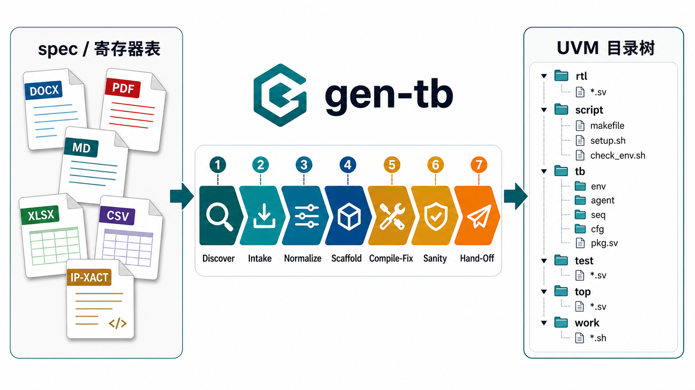

# gen-tb



A skill that generates a complete UVM testbench scaffold for a single IP
from its specification documents (docx / pdf / md) and register table
(xlsx / csv / md / IP-XACT). Runs under both **Claude Code** and
**Codex CLI** (via the Codex Claude Code plugin / shared skill loader) —
the 7-phase pipeline, scaffold scripts, and eval harness are
host-agnostic. Targets dual personas:

- **DV engineers** drive the tb with UVM sequences and `uvm_test`s.
- **DE engineers** drive the tb through a thin `tb_api::` task-style BFM
  without needing UVM expertise.

## Status

**Pre-alpha implementation** — the skill entry point and the core
scaffold/eval scripts are present. Built-in first-class buses are
APB-slave, AHB-Lite (DUT-as-slave or DUT-as-master), and AXI4-Lite
(DUT-as-slave or DUT-as-master). Any other single-channel
request/response bus (I2C, SPI, Wishbone, custom register buses,
streaming interfaces) is handled by a **generic fallback**: the same
directory layout and sim flow, with the bus-shaped pieces inferred
per-IP by a constrained scaffold sub-agent from a structured
handshake description and the three built-in exemplars.

Local regression fixtures exercise all three built-in protocols in
both directions, external-VIP reuse for the slave directions, three
generic-bus handshake shapes (`req_ack`, `valid_ready`, renamed-APB),
and AXI4-Lite degraded mode for DUTs that expose full-AXI burst/ID
ports but only do single-beat transfers.

Currently in this repo:

```
evals/fixtures/    # regression fixtures: built-in buses (uart16550, aes128,
                   #   ahb/axi_lite simple), generic-bus shapes, AXI-full degraded
scripts/           # Input discovery, normalization, scaffold, eval helpers
references/        # Progressive-disclosure implementation contracts
SKILL.md           # Skill entry point
```

Local development notes under `docs/` and `plan/` are intentionally not
tracked. User-facing and skill-facing documentation lives in `README.md`
and `references/`.

## Project layout

```
gen-tb/
├── SKILL.md               # the skill entry point
├── references/            # progressive-disclosure detail docs
│   ├── directory_layout.md
│   ├── makefile_contract.md
│   ├── top_sv.md          # top/interface wiring
│   ├── apb.md             # APB agent generation rules
│   ├── apb_external_vip.md
│   ├── ahb.md             # AHB-Lite agent generation rules
│   ├── ahb_external_vip.md
│   ├── axi_lite.md        # AXI4-Lite agent generation rules (slave + master + degraded)
│   ├── axi_lite_external_vip.md
│   ├── generic_bus.md     # generic-bus scaffold contract + review checklist
│   ├── sub_agent_generic_scaffold.md  # generic-mode scaffold sub-agent
│   ├── ral_gen.md
│   ├── refm_dpi.md        # C/Python DPI ref model integration
│   ├── tb_api.md          # DE-friendly task BFM
│   ├── rtl_discovery.md   # Phase 1 schema + bus classification
│   ├── rtl_stub.md        # generated RTL stub
│   ├── spec_parsing.md
│   ├── registers_yaml_schema.md
│   ├── generated_claude_md.md  # generated per-IP CLAUDE.md
│   └── sub_agent_compile_fix.md
├── scripts/               # discover_inputs.py, parse_regs.py, scaffold.py, ...
└── evals/
    └── fixtures/          # see evals/fixtures/README.md
```

## Generated testbench layout

The skill always materializes the same directory shape (modeled on
[uart_uvm_demo](https://github.com/uart_uvm_demo)):

```
<ip>/
├── .prj_top
├── rtl/         # Either user RTL discovered in place, or a stub.
├── script/      # makefile, setup.sh, optional setup.csh, check_env.sh
├── tb/          # UVM env, agents, scoreboard, RAL, ref_model, tb_api
├── test/        # uvm_test classes, sv_list, pkg
├── top/         # tb_top.sv, assertions
└── work/        # Per-case sim outputs (gitignored)
    └── _gen_audit/   # intake.yaml, compile-fix attempts, unresolved.md
```

## Supported scope (v1)

| Dimension | Scope |
|---|---|
| Bus protocol (built-in) | APB slave, AHB-Lite (slave or master), AXI4-Lite (slave or master) |
| Bus protocol (generic fallback) | any single-channel request/response bus the scaffold sub-agent can infer — `req_ack` / `valid_ready` / `strobe` / `custom` handshakes |
| AXI4 full | out of scope; DUTs with AXI burst/ID ports that only do single-beat transfers get an AXI4-Lite degraded-mode environment with `AWLEN/ARLEN==0` assertions |
| Simulator | VCS, Questa (vlog/vsim — static-only, see SKILL.md note), xrun (Cadence Xcelium); multi-select via `intake.yaml: simulators` |
| Ref model lang | none / SV / C-DPI; Python-DPI schema only |
| RAL input | xlsx / csv / md tables / IP-XACT (optional — `register_semantics: no` for non-register buses) |
| Spec input | docx / pdf / md |
| RTL state | Existing / external path / stub-from-spec |

## Development and evals

`scripts/run_evals.py` is a development harness, not part of the
runtime skill contract. It builds temporary projects under
`/tmp/gen-tb-evals`, runs the scaffold flow against fixtures, compiles
with VCS, and checks generated-file and sanity expectations.

Run the full local regression before committing changes to parser,
scaffold, compile, or eval behavior:

```bash
source ~/.bashrc >/dev/null 2>&1 || true
python3 scripts/run_evals.py
```

For documentation-only changes, the system `skill-creator`
`quick_validate.py` check is usually enough.

## License

This skill is released under the Apache-2.0 License (see `LICENSE`).
Regression fixtures under `evals/fixtures/` carry their own upstream
licenses — see `evals/fixtures/LICENSE.notes.md` for the breakdown.
The release tarball excludes fixtures with restrictive licenses via
`.gitattributes`.

## Acknowledgements

The skill design draws on patterns from the
[`skill-creator`](https://github.com/anthropics/skills) skill
(progressive disclosure, eval harness, description optimization) and
the project structure of `uart_uvm_demo`.
